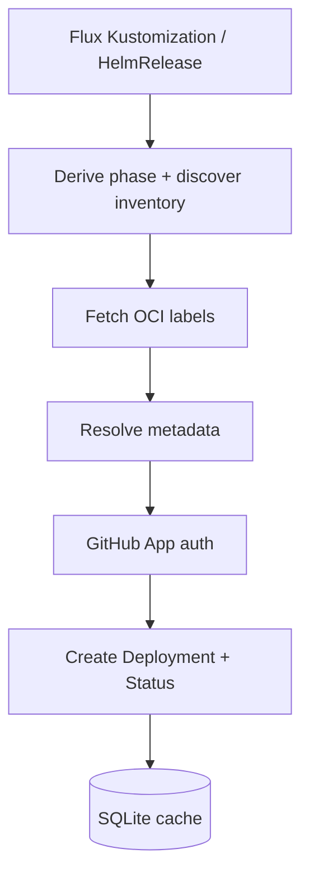

<!--
SPDX-FileCopyrightText: 2026 Robert Eggl <robert@eggl.dev>

SPDX-License-Identifier: Apache-2.0
-->

# github-deployment-bridge

[](https://roberteggl.github.io/github-deployment-bridge/)
[](https://api.reuse.software/info/github.com/roberteggl/github-deployment-bridge)
[](https://scorecard.dev/viewer/?uri=github.com/roberteggl/github-deployment-bridge)
[](https://github.com/roberteggl/github-deployment-bridge/attestations)
[](docs/releasing.md#verify-signatures-and-attestations)

A lightweight Kubernetes controller that bridges **FluxCD** reconciliations to the **GitHub Deployments API**.

When a Flux `Kustomization` or `HelmRelease` reconciles, the bridge inspects deployed container images, reads standard OCI labels (with optional Kubernetes annotation overrides), and reports the full GitHub Deployment lifecycle (`queued` → `in_progress` → `success` / `failure`) for the discovered repository and commit - with zero per-application mapping database.

## How it works



### OCI labels

| Label | Required | Example |
|---|---|---|
| `org.opencontainers.image.source` | yes\* | `https://github.com/example/backend` |
| `org.opencontainers.image.revision` | yes\* | `0123456789abcdef` |
| `org.opencontainers.image.version` | no | `v1.8.4` |
| `org.opencontainers.image.title` | no | `backend` |
| `org.opencontainers.image.created` | no | `2026-07-25T12:00:00Z` |

\*Unless overridden by a Kubernetes annotation. See [docs/architecture.md](docs/architecture.md#metadata-resolution).

### Kubernetes annotations (optional)

Prefix: `github-deployment-bridge.io/` — for example `environment`, `repository`, `auto-report`, `deployment-name`. Full list and priority rules: [docs/architecture.md](docs/architecture.md#kubernetes-annotations).

## Install

Full guide (GitHub App permissions, secrets, PVC, Helm values, verify):
**[Install](https://roberteggl.github.io/github-deployment-bridge/install/)** · [docs/install/](docs/install/).

Quick start with an existing Secret:

```bash
kubectl -n flux-system create secret generic github-deployment-bridge \
  --from-literal=app-id=123456 \
  --from-literal=installation-id=987654 \
  --from-file=private-key=./github-app.pem

helm upgrade --install github-deployment-bridge \
  oci://ghcr.io/roberteggl/charts/github-deployment-bridge \
  --version 1.2.0 \
  --namespace flux-system \
  --set github.existingSecret=github-deployment-bridge \
  --set config.clusterName=production-eu \
  --set config.environment=production
```

### GitHub App (summary)

| Permission | Access |
|---|---|
| **Deployments** | Read & Write |
| **Contents** | Read |
| **Metadata** | Read |

PATs are not supported. Details: [docs/install/github-app.md](docs/install/github-app.md).

### Configuration

Env vars and Helm mapping: [docs/configuration/](docs/configuration/).

Why a PVC: SQLite at `/data/cache.db` deduplicates
`(owner, repo, environment, commitSHA, deploymentName)` across restarts - see
[docs/install/persistence.md](docs/install/persistence.md).

## Observability

| Endpoint | Purpose |
|---|---|
| `/metrics` | Prometheus metrics |
| `/healthz` | Liveness |
| `/readyz` | Readiness |

Metrics include `deployments_created_total`, `deployment_status_updates_total`, `deployment_failures_total`, `deployment_errors_total`, `deployment_duplicates_skipped_total`, `deployment_inactive_total`, `github_api_requests_total`, `github_api_failures_total`, `github_api_latency_seconds`, and `oci_requests_total`.

Image: `ghcr.io/roberteggl/github-deployment-bridge:<version>` (multi-arch `amd64`/`arm64`, Cosign-signed, SLSA-attested).

Verify artifacts: [docs/releasing.md](docs/releasing.md#verify-signatures-and-attestations) · [Attestations](https://github.com/roberteggl/github-deployment-bridge/attestations)

## Development

```bash
make tidy test build
```

See [CONTRIBUTING.md](CONTRIBUTING.md), [docs/install/](docs/install/),
[docs/development.md](docs/development.md), [docs/architecture.md](docs/architecture.md),
and [docs/releasing.md](docs/releasing.md).

## Non-goals

This project does **not** reconcile GitOps state, trigger deployments, run CI, or manage image automation. It only observes Flux reconciliations and synchronizes deployment lifecycle state into GitHub.

## Licensing

This project follows the [REUSE](https://reuse.software/) specification.
Copyright and license information is declared per file via SPDX headers. The full Apache License 2.0 text lives in
[`LICENSES/Apache-2.0.txt`](LICENSES/Apache-2.0.txt).
