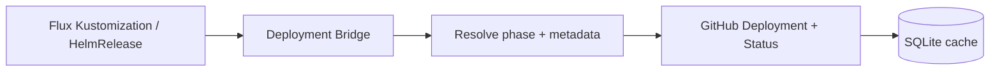
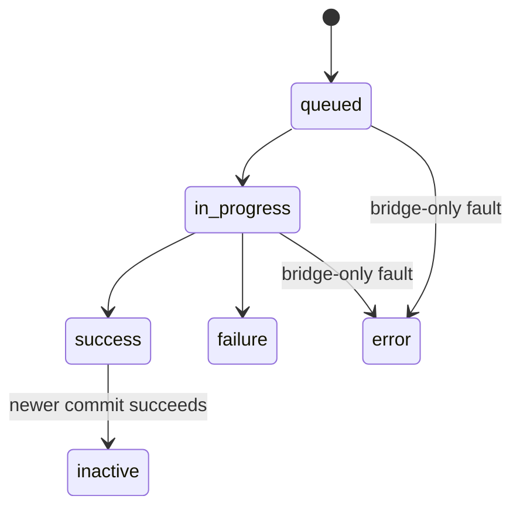
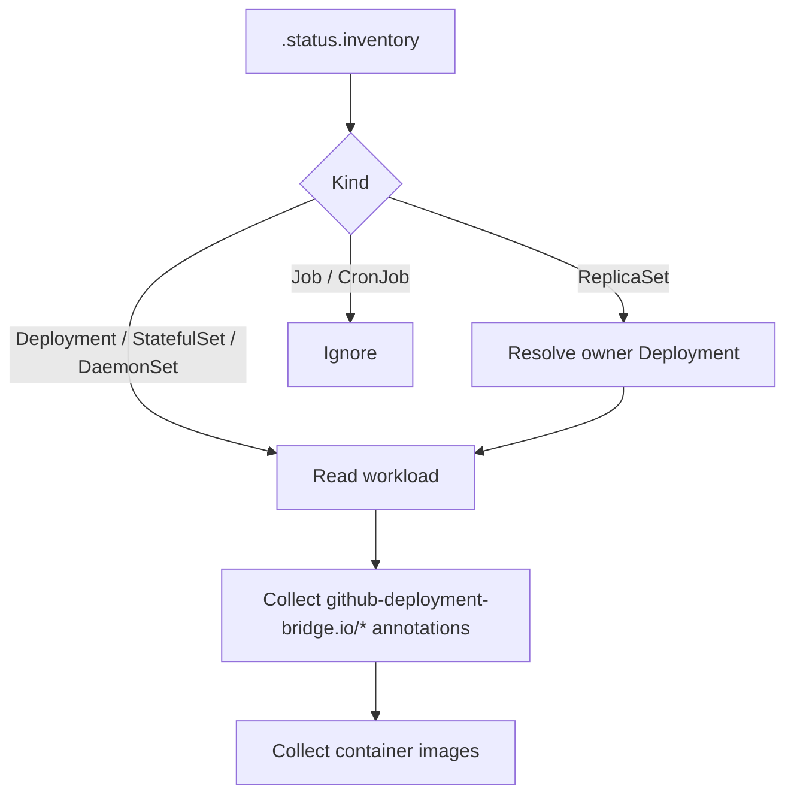
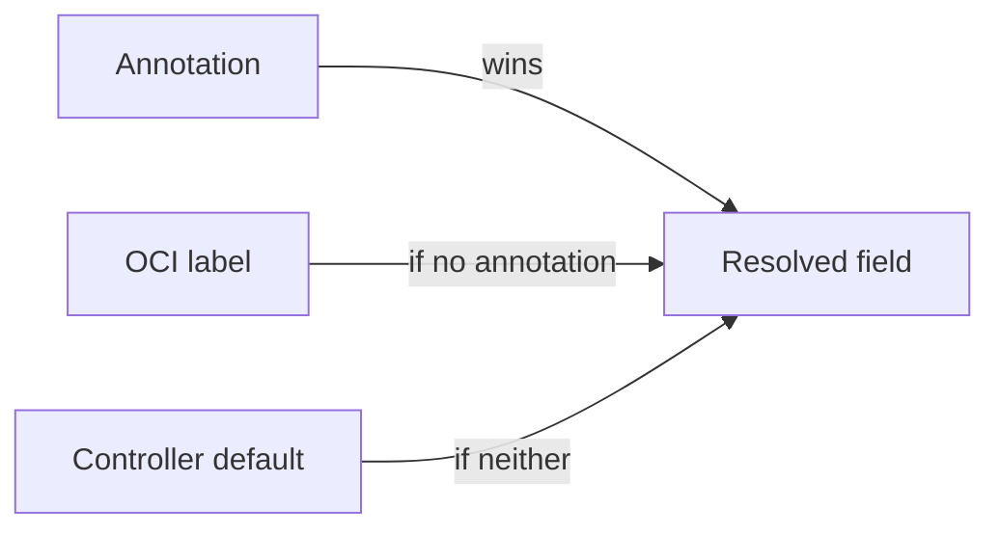

<!--
SPDX-FileCopyrightText: 2026 Robert Eggl <robert@eggl.dev>

SPDX-License-Identifier: Apache-2.0
-->

# Architecture



## Design principles

- **Opt-in reporting** - only workloads with `github-deployment-bridge.io/auto-report=true` are reported; others are skipped quietly.
- **OCI labels are canonical for build metadata** - repository and commit come from standard image labels.
- **Kubernetes annotations are optional overrides** - deployment-specific environment, URLs, and opt-outs.
- **Zero per-app mapping database** - no repository-specific configuration beyond annotations on the workload.
- **Observe only** - the bridge never triggers deployments or mutates cluster workloads.
- **Full GitHub Deployments lifecycle** - one Deployment per `(owner, repo, environment, commit, deploymentName)` with status updates as Flux progresses.
- **Safe reconcile loop** - missing/invalid metadata skips a workload with a warning; transient GitHub/OCI errors retry with backoff (GitHub `Retry-After` / rate-reset honored).
- **Single-writer cache** - SQLite on a PVC is the intentional HA model: one replica, Recreate upgrades, node loss means reschedule downtime (not active-active). Multi-writer would require a different store.

## Flux sources

The bridge watches:

| Kind | API | Inventory |
|---|---|---|
| `Kustomization` | `kustomize.toolkit.fluxcd.io/v1` | `.status.inventory` |
| `HelmRelease` | `helm.toolkit.fluxcd.io/v2` | `.status.inventory` (Flux ≥ 2.8 / helm-controller ≥ 1.5) |

Events fire when conditions, `observedGeneration`, or revision fields change. Reporting runs only when inventory yields at least one resolvable workload image.

## Phase derivation

| Desired phase | Flux signal |
|---|---|
| `success` | `Ready=True` and `generation == observedGeneration` |
| `failure` | `Ready=False` (observed) or `Stalled=True`, or known failure reasons (`HealthCheckFailed`, `InstallFailed`, …) |
| `in_progress` | `Reconciling=True`, or Ready not True while not yet a failure |

The reporter maps desired phases onto GitHub statuses with an idempotent state machine:



- **Catch-up:** if the cache is empty and Flux is already terminal, emit only that terminal status (no synthetic history).
- **Early states:** `queued` then `in_progress` when first observing an in-progress reconcile for a new commit.
- Never transition `success` → `in_progress`. Never send duplicate identical statuses.

## Workload discovery



1. Parse `.status.inventory` for `Deployment`, `StatefulSet`, and `DaemonSet`.
2. Resolve `ReplicaSet` entries via owner references to their controlling `Deployment`.
3. Ignore `Job` / `CronJob`.
4. Collect `github-deployment-bridge.io/*` annotations from the workload (and pod template as fallback).

Empty inventory (including HelmRelease on Flux before 2.8) → skip.

## Metadata resolution

Priority for every field:

1. Kubernetes annotation
2. OCI label
3. Controller default (if applicable)



### OCI labels

| Label | Required | Purpose |
|---|---|---|
| `org.opencontainers.image.source` | yes\* | GitHub owner/repository |
| `org.opencontainers.image.revision` | yes\* | Git commit SHA (Deployment ref) |
| `org.opencontainers.image.version` | no | Logging / payload |
| `org.opencontainers.image.title` | no | Logging |
| `org.opencontainers.image.created` | no | Diagnostics |

\*Required unless overridden by the matching Kubernetes annotation.

### Kubernetes annotations

Prefix: `github-deployment-bridge.io/`

| Annotation | Overrides | Purpose |
|---|---|---|
| `repository` | OCI `source` | `owner/repo` when multiple apps share an image |
| `commit` | OCI `revision` | Exceptional commit override |
| `environment` | `ENVIRONMENT` | GitHub Deployment environment |
| `environment-url` | `ENVIRONMENT_URL` | Deployment Status `environment_url` |
| `log-url` | `LOG_URL_TEMPLATE` | Deployment Status `log_url` (both support `{sha}` / `{namespace}` / `{name}` / `{service}` / `{environment}` / `{cluster}`) |
| `description` | `DESCRIPTION` (default `Deployed by FluxCD`) | Deployment description |
| `production` | derived from env name | `production_environment` (`true`/`false`) |
| `auto-report` | _(none)_ | **Opt-in.** Must be `true` to report; absent/`false` ignores the workload (no OCI fetch, no warning spam) |
| `deployment-name` | repository name | Independent reports for monorepo workloads (also GitHub `task`; see [Monorepos](#monorepos)) |
| `cluster` | `CLUSTER_NAME` | Deployment payload `cluster` (API only) |
| `team` | _(none)_ | Deployment payload `team` (API only) |
| `service` | _(none)_ | Deployment payload `service` (API only) |
| `component` | _(none)_ | Deployment payload `component` (API only) |
| `slack-channel` | _(none)_ | Deployment payload `slackChannel` (API only) |
| `owner` | _(none)_ | Deployment payload `owner` (service owner, not GitHub repo owner; API only) |
| `release` | _(none)_ | Deployment payload `release` (API only) |
| `tag` | _(none)_ | Deployment payload `tag` (API only) |

### Validation

| Field | Rule |
|---|---|
| Repository | Must resolve to `owner/repository` |
| Commit | Valid Git SHA (7-40 hex) |
| Environment | Non-empty |
| Environment / log URL | Absolute `https://` URL when set |

Missing or invalid required metadata → skip reporting and emit a warning. Never fail reconciliation for that reason.

### GitHub Deployment mapping

| Resolved field | GitHub field | Visible in GitHub UI |
|---|---|---|
| Repository | Deployment repository | yes |
| Commit | Deployment `ref` | yes |
| Environment | Deployment `environment` | yes |
| Production | `production_environment` | yes (Environments) |
| Description | Deployment `description` | yes |
| Deployment name (when annotated) | Deployment `task` | no (API / webhooks only) |
| Environment URL | Status `environment_url` | yes |
| Log URL | Status `log_url` | yes |

Deployment `payload` includes `cluster`, `namespace` (workload), `sourceNamespace` (Flux
Kustomization / HelmRelease namespace), source name (`kustomization` / `helmRelease`),
`deploymentName`, `image`, optional `digest` / `version`, `controllerVersion`, and any
optional annotation fields (`team`, `service`, `component`, `slackChannel`, `owner`,
`release`, `tag`). The `cluster` annotation overrides the controller `CLUSTER_NAME` env.

**GitHub UI does not render custom payload fields.** Values such as `team`, `service`,
`component`, `slackChannel`, `owner`, `release`, `tag`, and `cluster` are stored on the
Deployment and returned by the API / webhooks for integrations — they do not appear as
labels in the repository Deployments page. Prefer `environment`, `description`, or
`environment-url` when you need something visible in the UI.

Crash recovery also matches older payloads that used the Flux source namespace as
`namespace` and omitted `sourceNamespace`.

Status updates set `auto_inactive=false`. GitHub's environment-scoped auto-inactive would
otherwise deactivate sibling monorepo deployments that share an environment. When a newer
commit reaches `success` for the same identity (`deploymentName` included), the bridge
explicitly marks prior cached `success` deployments `inactive`.

Deduplication cache key: `(owner, repo, environment, commitSHA, deploymentName)`. Before creating a Deployment, the bridge writes a provisional cache row (`deployment_id=0`). It then searches GitHub for an existing Deployment with the same ref, environment, and payload (crash recovery) and only creates when none is found. The resolved `deployment_id` is persisted before status updates.

### Monorepos

When multiple workloads in one GitHub repository should report independently (for example
frontend and backend), you have two options:

| Approach | Annotation | Multiple active deployments | GitHub UI |
|---|---|---|---|
| Distinct deployment names | `deployment-name` (`frontend` / `backend`) | yes — cache identity includes `deploymentName`; bridge supersedes only within that name | Weak — `task` / name is not shown as a first-class label; both appear under the same environment |
| Distinct environments | `environment` (`production-frontend` / `production-backend`) | yes — environments are independent | Best — each environment is listed separately with its own active deployment |

**Recommendation:** use different `environment` values for the best Deployments UI
experience. Use `deployment-name` when you want independent tracking (and correct
active supersession) while keeping a shared environment name; combine both when useful
(`environment` for UI grouping, `deployment-name` for API identity).

Without `deployment-name`, both workloads default to the repository name and share one
cache identity — only one active deployment is tracked for that key.

```yaml
# Best UI: separate environments
metadata:
  annotations:
    github-deployment-bridge.io/auto-report: "true"
    github-deployment-bridge.io/environment: "production-frontend"
    github-deployment-bridge.io/deployment-name: "frontend"
---
metadata:
  annotations:
    github-deployment-bridge.io/auto-report: "true"
    github-deployment-bridge.io/environment: "production-backend"
    github-deployment-bridge.io/deployment-name: "backend"
```
