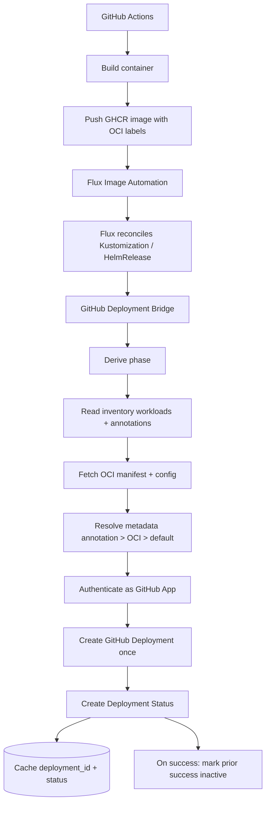
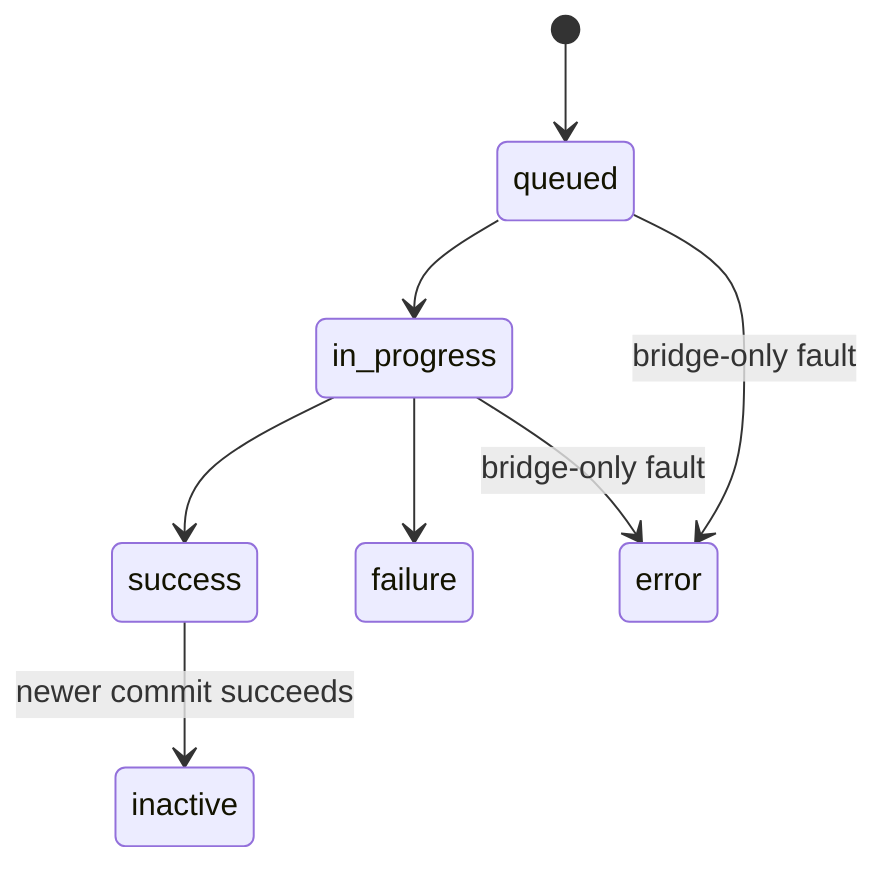
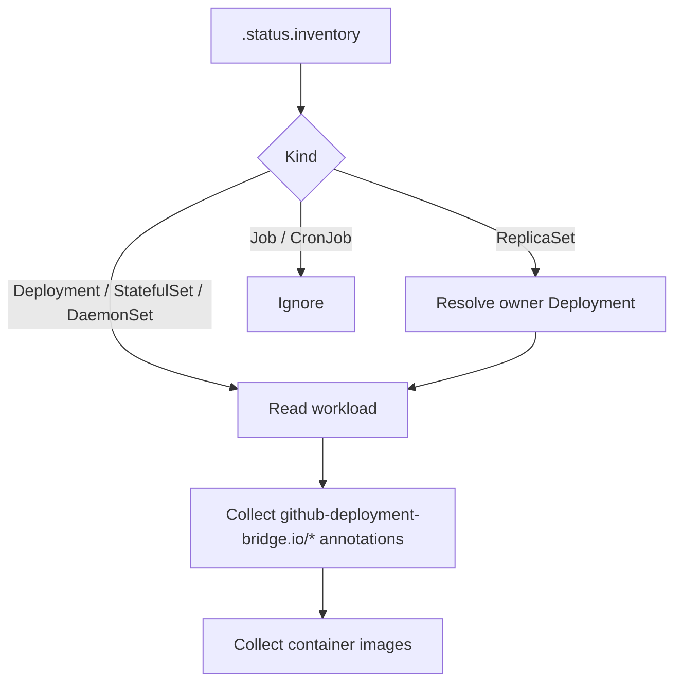
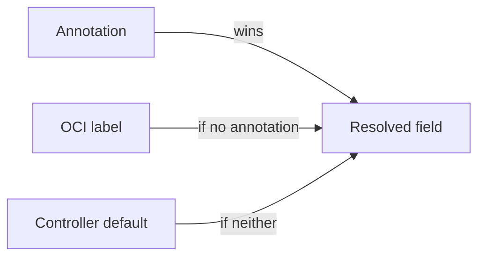

<!--
SPDX-FileCopyrightText: 2026 Robert Eggl <robert@eggl.dev>

SPDX-License-Identifier: Apache-2.0
-->

# Architecture

## Design principles

- **OCI labels are canonical for build metadata** - repository and commit come from standard image labels.
- **Kubernetes annotations are optional overrides** - deployment-specific environment, URLs, and opt-outs.
- **Zero per-app mapping database** - no repository-specific configuration beyond annotations on the workload.
- **Observe only** - the bridge never triggers deployments or mutates cluster workloads.
- **Full GitHub Deployments lifecycle** - one Deployment per `(owner, repo, environment, commit, deploymentName)` with status updates as Flux progresses.
- **Safe reconcile loop** - missing/invalid metadata skips a workload with a warning; transient GitHub/OCI errors retry with backoff.

## Flux sources

The bridge watches:

| Kind | API | Inventory |
|---|---|---|
| `Kustomization` | `kustomize.toolkit.fluxcd.io/v1` | `.status.inventory` |
| `HelmRelease` | `helm.toolkit.fluxcd.io/v2` | `.status.inventory` (Flux ≥ 2.8 / helm-controller ≥ 1.5) |

Events fire when conditions, `observedGeneration`, or revision fields change. Reporting runs only when inventory yields at least one resolvable workload image.

## Phase derivation

| Desired phase | Flux signal |
|---|---|
| `success` | `Ready=True` and `generation == observedGeneration` |
| `failure` | `Ready=False` (observed) or `Stalled=True`, or known failure reasons (`HealthCheckFailed`, `InstallFailed`, …) |
| `in_progress` | `Reconciling=True`, or Ready not True while not yet a failure |

The reporter maps desired phases onto GitHub statuses with an idempotent state machine:

- **Catch-up:** if the cache is empty and Flux is already terminal, emit only that terminal status (no synthetic history).
- **Early states:** `queued` then `in_progress` when first observing an in-progress reconcile for a new commit.
- Never transition `success` → `in_progress`. Never send duplicate identical statuses.

## Workload discovery

1. Parse `.status.inventory` for `Deployment`, `StatefulSet`, and `DaemonSet`.
2. Resolve `ReplicaSet` entries via owner references to their controlling `Deployment`.
3. Ignore `Job` / `CronJob`.
4. Collect `github-deployment-bridge.io/*` annotations from the workload (and pod template as fallback).

Empty inventory (including HelmRelease on Flux before 2.8) → skip.

## Metadata resolution

Priority for every field:

1. Kubernetes annotation
2. OCI label
3. Controller default (if applicable)

### OCI labels

| Label | Required | Purpose |
|---|---|---|
| `org.opencontainers.image.source` | yes\* | GitHub owner/repository |
| `org.opencontainers.image.revision` | yes\* | Git commit SHA (Deployment ref) |
| `org.opencontainers.image.version` | no | Logging / payload |
| `org.opencontainers.image.title` | no | Logging |
| `org.opencontainers.image.created` | no | Diagnostics |

\*Required unless overridden by the matching Kubernetes annotation.

### Kubernetes annotations

Prefix: `github-deployment-bridge.io/`

| Annotation | Overrides | Purpose |
|---|---|---|
| `repository` | OCI `source` | `owner/repo` when multiple apps share an image |
| `commit` | OCI `revision` | Exceptional commit override |
| `environment` | `ENVIRONMENT` | GitHub Deployment environment |
| `environment-url` | `ENVIRONMENT_URL` | Deployment Status `environment_url` |
| `log-url` | `LOG_URL_TEMPLATE` | Deployment Status `log_url` |
| `description` | default text | Deployment description |
| `production` | derived from env name | `production_environment` (`true`/`false`) |
| `auto-report` | default `true` | `false` ignores the workload entirely |
| `deployment-name` | repository name | Independent reports for monorepo workloads (also GitHub `task`) |

Reserved for future use (recognized, ignored in v1): `team`, `service`, `component`, `slack-channel`, `owner`, `release`, `tag`, `cluster`.

### Validation

| Field | Rule |
|---|---|
| Repository | Must resolve to `owner/repository` |
| Commit | Valid Git SHA (7–40 hex) |
| Environment | Non-empty |
| Environment / log URL | Absolute `https://` URL when set |

Missing or invalid required metadata → skip reporting and emit a warning. Never fail reconciliation for that reason.

### GitHub Deployment mapping

| Resolved field | GitHub field |
|---|---|
| Repository | Deployment repository |
| Commit | Deployment `ref` |
| Environment | Deployment `environment` |
| Production | `production_environment` |
| Description | Deployment `description` |
| Deployment name (when annotated) | Deployment `task` |
| Environment URL | Status `environment_url` |
| Log URL | Status `log_url` |

Deployment `payload` includes `cluster`, `namespace`, source name (`kustomization` / `helmRelease`), `deploymentName`, `image`, optional `digest` / `version`, and `controllerVersion`.

Status updates set `auto_inactive=true`. When a newer commit reaches `success` for the same identity, prior cached `success` deployments are explicitly marked `inactive`.

Deduplication cache key: `(owner, repo, environment, commitSHA, deploymentName)`. The cache stores `deployment_id` immediately after create (before status) so controller restarts never duplicate Deployments.
