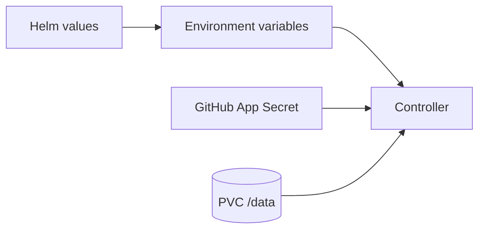

<!--
SPDX-FileCopyrightText: 2026 Robert Eggl <robert@eggl.dev>

SPDX-License-Identifier: Apache-2.0
-->

# Configuration

The bridge is configured entirely via environment variables. When installed with
Helm, set the corresponding `config.*` / `github.*` / `persistence.*` values
instead (see [Install](../install/)).

## Sections

| Page | Contents |
|---|---|
| [Environment variables](./environment.md) | Full env var reference |
| [Helm values map](./helm-values.md) | Chart value → env mapping |
| [Secrets](./secrets.md) | GitHub App credential Secret |
| [Persistence](./persistence.md) | SQLite cache PVC |
| [GitHub App permissions](./github-app.md) | Required App scopes |
| [Private registries](./registries.md) | Docker config for OCI label reads |
| [Metrics](./metrics.md) | Prometheus metrics |
