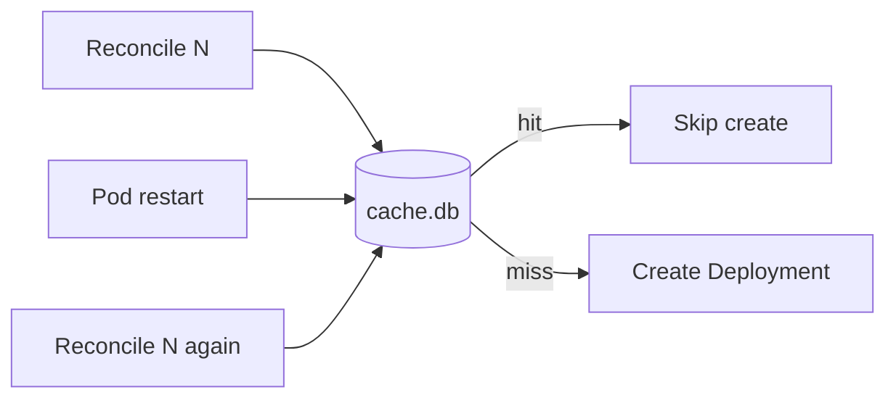

<!--
SPDX-FileCopyrightText: 2026 Robert Eggl <robert@eggl.dev>

SPDX-License-Identifier: Apache-2.0
-->

# Persistence (PVC)

The SQLite cache at `DATABASE` (`/data/cache.db` in the chart) stores
`(owner, repo, environment, commitSHA, deploymentName)`, the GitHub
`deployment_id`, and the latest status so reconciles are idempotent across
restarts (and so monorepo workloads with distinct `deployment-name` annotations
stay independent).

| Helm value | Default | Description |
|---|---|---|
| `persistence.enabled` | `true` | Use a PVC for `/data` |
| `persistence.size` | `1Gi` | Claim size |
| `persistence.storageClass` | `""` | Empty = cluster default |
| `persistence.accessMode` | `ReadWriteOnce` | Single writer |

Disable only for ephemeral/dev clusters. Without a PVC, an `emptyDir` is used
and the cache is wiped on every pod reschedule (duplicate Deployments may
appear in GitHub).

Why this matters: [Install → Why a PVC?](../install/persistence.md)
