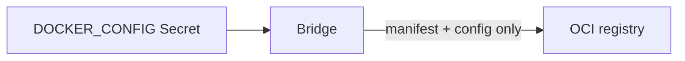

<!--
SPDX-FileCopyrightText: 2026 Robert Eggl <robert@eggl.dev>

SPDX-License-Identifier: Apache-2.0
-->

# Private registries

The bridge uses the default Docker/OCI keychain (`authn.DefaultKeychain`) when
reading OCI labels. That is **not** the same as `imagePullSecrets` (which only
pull this chart's own image).



For private registries such as GHCR, point the chart at an existing
`kubernetes.io/dockerconfigjson` Secret - often the same one Flux
`ImageRepository` / workload Deployments already use:

```yaml
registry:
  existingDockerConfigSecret: ghcr-pull-secret
  # dockerConfigKey: ".dockerconfigjson"   # default
```

The chart mounts the Secret key as `/var/run/secrets/docker/config.json` and
sets `DOCKER_CONFIG=/var/run/secrets/docker`.

For GHCR, the credentials need `read:packages` (PAT, fine-grained token, or
equivalent). The GitHub App used for Deployments is not used for registry auth.

Only the image manifest and config blob are fetched - layers are never pulled.

Helm install example: [Install → Private image registries](../install/registries.md)
