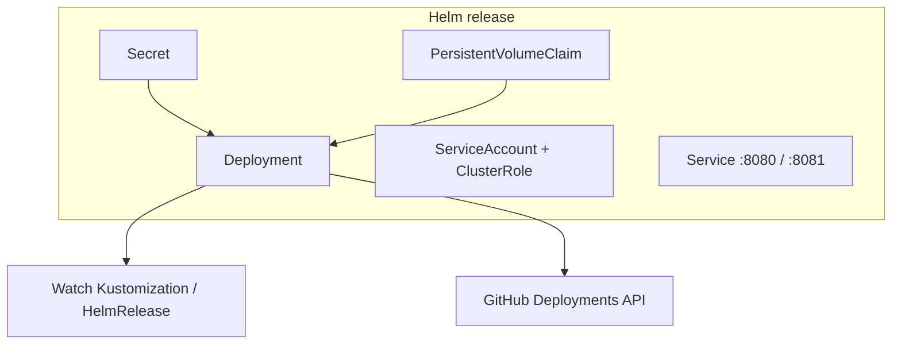

<!--
SPDX-FileCopyrightText: 2026 Robert Eggl <robert@eggl.dev>

SPDX-License-Identifier: Apache-2.0
-->

# Install with Helm

## From the published OCI chart

```bash
# Secret must already exist (see Secrets)
helm upgrade --install github-deployment-bridge \
  oci://ghcr.io/roberteggl/charts/github-deployment-bridge \
  --version 1.2.2 \
  --namespace flux-system \
  --create-namespace \
  --set github.existingSecret=github-deployment-bridge \
  --set config.clusterName=production-eu \
  --set config.environment=production \
  --set config.environmentURL=https://app.example.com \
  --set config.logURLTemplate='https://grafana.example.com/explore?commit={sha}'
```

## From a local checkout

```bash
helm upgrade --install github-deployment-bridge \
  charts/github-deployment-bridge \
  --namespace flux-system \
  --set github.existingSecret=github-deployment-bridge \
  --set config.clusterName=production-eu \
  --set config.environment=production
```

## Minimal values file

```yaml
# values-production.yaml
config:
  clusterName: production-eu
  environment: production
  watchNamespace: ""          # empty = all namespaces
  environmentURL: https://app.example.com
  logURLTemplate: https://grafana.example.com/explore?commit={sha}

github:
  existingSecret: github-deployment-bridge

persistence:
  enabled: true
  size: 1Gi
```

```bash
helm upgrade --install github-deployment-bridge \
  oci://ghcr.io/roberteggl/charts/github-deployment-bridge \
  --version 1.2.2 \
  --namespace flux-system \
  -f values-production.yaml
```

## What the chart installs



| Resource | Purpose |
|---|---|
| `Deployment` | Controller pod |
| `ServiceAccount` + `ClusterRole` / `ClusterRoleBinding` | Watch Flux Kustomizations, HelmReleases, and workloads |
| `Secret` | GitHub App credentials (unless `existingSecret`) |
| `PersistentVolumeClaim` | SQLite duplicate-prevention cache |
| `Service` | Metrics (`:8080`) and probes (`:8081`) |

Cluster RBAC (read-only for workloads):

- `kustomize.toolkit.fluxcd.io/kustomizations`: get, list, watch
- `helm.toolkit.fluxcd.io/helmreleases`: get, list, watch
- `apps` Deployments / StatefulSets / DaemonSets / ReplicaSets: get, list, watch
- `coordination.k8s.io/leases`: leader election
- `events`: create, patch

## Configuration knobs

All runtime settings are environment variables. Helm `config.*` / `github.*`
values map to those vars. Full reference: [Configuration](../configuration/).

| Helm value | Env | Meaning |
|---|---|---|
| `config.clusterName` | `CLUSTER_NAME` | Logical name in logs |
| `config.environment` | `ENVIRONMENT` | GitHub deployment environment name |
| `config.watchNamespace` | `WATCH_NAMESPACE` | Limit to one namespace; empty = cluster-wide |
| `config.environmentURL` | `ENVIRONMENT_URL` | Optional URL on deployment statuses |
| `config.logURLTemplate` | `LOG_URL_TEMPLATE` | Optional log link; `{sha}` → commit |
| `config.githubBaseURL` | `GITHUB_BASE_URL` | GitHub Enterprise base URL |

Next: [Verify](./verify.md)
