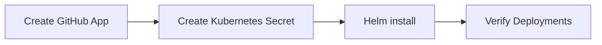

<!--
SPDX-FileCopyrightText: 2026 Robert Eggl <robert@eggl.dev>

SPDX-License-Identifier: Apache-2.0
-->

# Install in a cluster

Install **GitHub Deployment Bridge** with Helm alongside FluxCD: GitHub App,
secrets, persistence, and verification.



## Prerequisites

- A Kubernetes cluster with [FluxCD](https://fluxcd.io/) installed
  (`Kustomization` CRDs; `HelmRelease` CRDs if you want Helm reporting)
- Helm 3
- A GitHub App (see [GitHub App setup](./github-app.md)) installed on the
  repositories you deploy
- Workload images that carry the required OCI labels (below), or equivalent
  `github-deployment-bridge.io/*` annotations

The bridge is an observer only. It does not reconcile GitOps state or mutate
workloads. Install it in a namespace that can watch Flux `Kustomization` and
`HelmRelease` resources (commonly `flux-system`).

HelmRelease inventory (required for image discovery) needs Flux ≥ 2.8 /
helm-controller ≥ 1.5; older clusters simply skip HelmReleases with empty inventory.

## Required OCI labels

Bake these into each workload image so the bridge can resolve the GitHub
repository and commit. Only two labels are required:

| Label | Required | Example |
|---|---|---|
| `org.opencontainers.image.source` | yes\* | `https://github.com/example/backend` |
| `org.opencontainers.image.revision` | yes\* | `0123456789abcdef` |
| `org.opencontainers.image.version` | no | `v1.8.4` |
| `org.opencontainers.image.title` | no | `backend` |
| `org.opencontainers.image.created` | no | `2026-07-25T12:00:00Z` |

\*Required unless overridden by the matching Kubernetes annotation
(`github-deployment-bridge.io/repository` / `commit`). Workloads that use
annotations must also set `auto-report=true`.

```dockerfile
LABEL org.opencontainers.image.source="https://github.com/example/backend" \
      org.opencontainers.image.revision="0123456789abcdef"
```

Full precedence and annotation list:
[Metadata resolution](../architecture.md#metadata-resolution).

## Steps

1. [GitHub App setup](./github-app.md)
2. [Secrets](./secrets.md)
3. [Persistence (PVC)](./persistence.md)
4. [Install with Helm](./helm.md)
5. [Verify](./verify.md)

Optional: [Private image registries](./registries.md) · [Uninstall](./uninstall.md)
