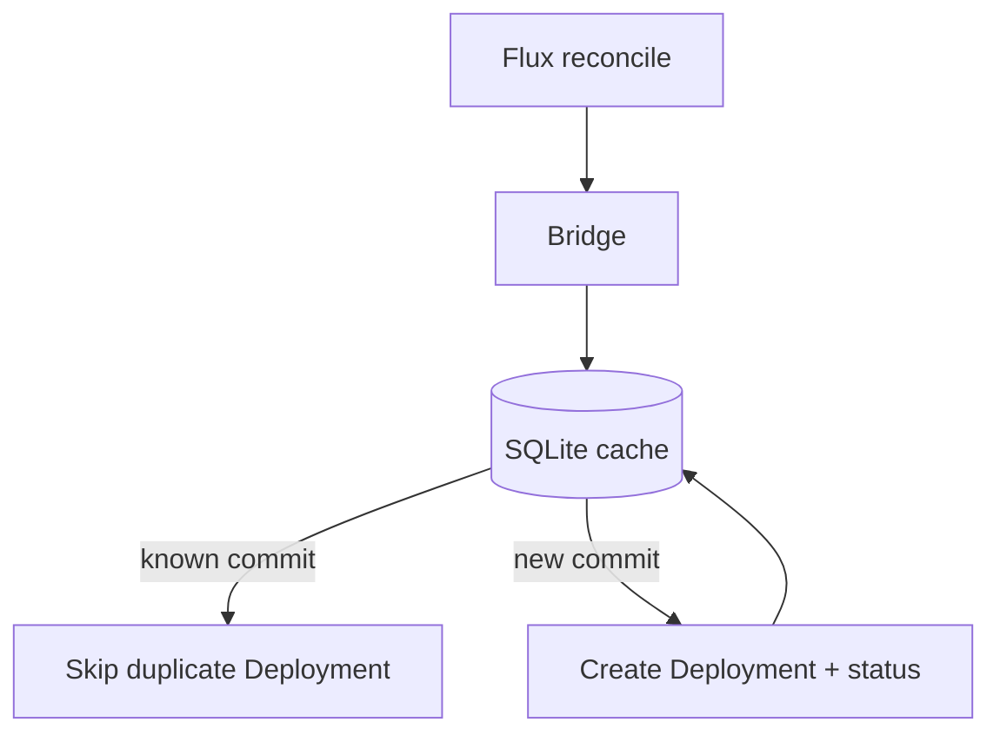

<!--
SPDX-FileCopyrightText: 2026 Robert Eggl <robert@eggl.dev>

SPDX-License-Identifier: Apache-2.0
-->

# Why a PVC?

The bridge keeps a small SQLite database at `/data/cache.db` keyed by
`(owner, repo, environment, commitSHA, deploymentName)`. That cache prevents
duplicate GitHub Deployments when Flux re-reconciles the same commit.

With `persistence.enabled=true` (the chart default):

- A 1Gi `PersistentVolumeClaim` backs `/data`
- Cache entries survive pod restarts and upgrades
- After a restart, the bridge still knows which commits were already reported

Without a PVC (`persistence.enabled=false`), the chart uses an `emptyDir`. The
cache is lost on every reschedule, so previously reported commits may be
reported again to GitHub.

| Setting | Default | Notes |
|---|---|---|
| `persistence.enabled` | `true` | Keep enabled in production |
| `persistence.size` | `1Gi` | More than enough for the SQLite file |
| `persistence.storageClass` | `""` | Cluster default StorageClass |
| `persistence.accessMode` | `ReadWriteOnce` | Single-replica controller |

## Single replica (production default)

The deduplication cache is **SQLite with a single writer**. The chart defaults
to one replica and a `ReadWriteOnce` PVC so only one pod can mount `/data`.

| Configuration | Safe for production? | Why |
|---|---|---|
| `replicaCount: 1`, `persistence.enabled: true`, RWO PVC | Yes | One writer, cache survives restarts |
| `replicaCount > 1`, RWO PVC | **No** | Second pod cannot mount the volume; if forced, each writer has a separate cache |
| `replicaCount > 1`, RWX PVC | **No** | Volume can be shared, but SQLite does not provide safe multi-writer semantics |
| `persistence.enabled: false` (`emptyDir`) | **No** | Cache wiped on every reschedule; duplicates likely |

The Helm chart **fails `helm template` / `helm install`** when
`replicaCount > 1` with `persistence.enabled: true` and
`persistence.accessMode: ReadWriteOnce` (the default). This blocks the most
common misconfiguration: scaling the Deployment while keeping the default RWO
claim.

`helm install` also prints a **WARNING** in release notes when
`persistence.enabled: false` (emptyDir) or when `replicaCount > 1` with
`ReadWriteMany` (shared volume without a shared-database backend).

**Recommendation:** keep `replicaCount: 1` and `persistence.enabled: true` in
production. Leader election (`config.leaderElection`, on by default) does not
make multiple replicas safe with separate or SQLite-backed caches.

Next: [Install with Helm](./helm.md)
