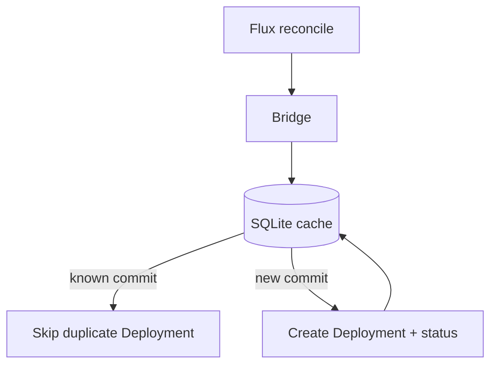

<!--
SPDX-FileCopyrightText: 2026 Robert Eggl <robert@eggl.dev>

SPDX-License-Identifier: Apache-2.0
-->

# Why a PVC?

The bridge keeps a small SQLite database at `/data/cache.db` keyed by
`(owner, repo, environment, commitSHA, deploymentName)`. That cache prevents
duplicate GitHub Deployments when Flux re-reconciles the same commit.

With `persistence.enabled=true` (the chart default):

- A 1Gi `PersistentVolumeClaim` backs `/data`
- Cache entries survive pod restarts and upgrades
- After a restart, the bridge still knows which commits were already reported
- The Deployment uses `strategy.type: Recreate` so rolling upgrades do not
  leave a new pod `Pending` while the volume is still attached to the old pod

Without a PVC (`persistence.enabled=false`), the chart uses an `emptyDir`. The
cache is lost on every reschedule, so previously reported commits may be
reported again to GitHub.

| Setting | Default | Notes |
|---|---|---|
| `persistence.enabled` | `true` | Keep enabled in production |
| `persistence.size` | `1Gi` | More than enough for the SQLite file |
| `persistence.storageClass` | `""` | Cluster default StorageClass |
| `persistence.accessMode` | `ReadWriteOnce` | Single-replica controller |

Leave `replicaCount` at `1` when using `ReadWriteOnce`. Leader election is on by
default if you scale later with a shared/ReadWriteMany volume.

Next: [Install with Helm](./helm.md)
