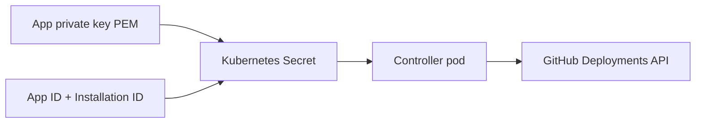

<!--
SPDX-FileCopyrightText: 2026 Robert Eggl <robert@eggl.dev>

SPDX-License-Identifier: Apache-2.0
-->

# Secrets

The controller needs three credentials from the GitHub App. They are read from a
Kubernetes Secret with these keys:

| Secret key | Env var | Description |
|---|---|---|
| `app-id` | `GITHUB_APP_ID` | Numeric GitHub App ID |
| `installation-id` | `GITHUB_INSTALLATION_ID` | Installation ID for the org/repos |
| `private-key` | (mounted as file) | PEM private key; path set via `GITHUB_PRIVATE_KEY_PATH` |

The Helm chart mounts `private-key` at `/github/private-key.pem` and sets
`GITHUB_PRIVATE_KEY_PATH` accordingly.



## Recommended: manage the Secret yourself

```bash
kubectl -n flux-system create secret generic github-deployment-bridge \
  --from-literal=app-id=123456 \
  --from-literal=installation-id=987654 \
  --from-file=private-key=./github-app.pem
```

Then install with `github.existingSecret=github-deployment-bridge`.

## Alternative: let Helm create the Secret

Pass values at install time (fine for local/dev; prefer an external Secret
manager or sealed/SOPS secret in production):

```bash
helm upgrade --install github-deployment-bridge \
  oci://ghcr.io/roberteggl/charts/github-deployment-bridge \
  --version 1.2.1 \
  --namespace flux-system \
  --set github.appId=123456 \
  --set github.installationId=987654 \
  --set-file github.privateKey=./github-app.pem \
  --set config.clusterName=production-eu \
  --set config.environment=production
```

Next: [Persistence](./persistence.md) · [Install with Helm](./helm.md)
