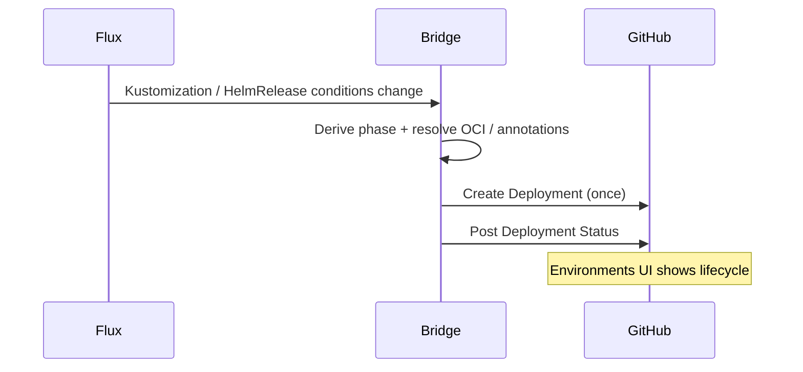

<!--
SPDX-FileCopyrightText: 2026 Robert Eggl <robert@eggl.dev>

SPDX-License-Identifier: Apache-2.0
-->

# Verify

```bash
# Pod running and ready
kubectl -n flux-system get deploy,pods,pvc -l app.kubernetes.io/name=github-deployment-bridge

# Logs
kubectl -n flux-system logs -l app.kubernetes.io/name=github-deployment-bridge -f

# Metrics
kubectl -n flux-system port-forward svc/github-deployment-bridge 8080:8080
curl -s localhost:8080/metrics | grep deployments_created
```

After Flux reconciles a `Kustomization` or `HelmRelease` whose inventory images
have resolvable metadata (OCI labels and/or annotations), you should see a
GitHub Deployment with lifecycle statuses for that commit under **Environments**
in the repository.


